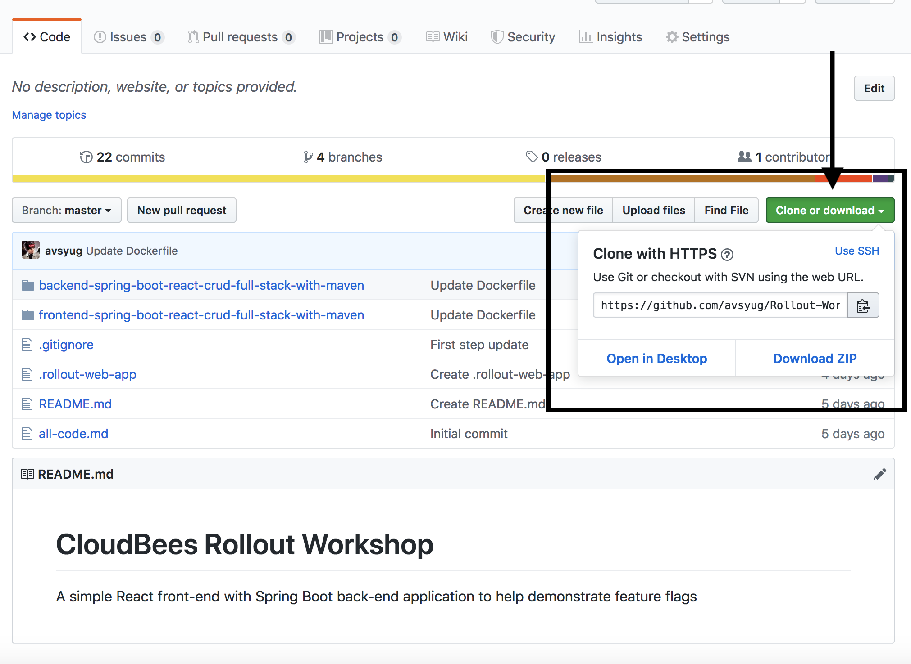

# Workshop Setup

## Sign Up For a Rollout Account 
You will need access to your own Rollout dashboard for this workshop, to do that please register for a Rollout account at https://app.rollout.io/signup

## Create a GitHub.com user account
Setup a GitHub.com user account that will be used later in this workshop. If you have an existing GitHub.com account you will be able to use it if you are comfortable using that account to create a GitHub Organization later in the workshop.

1. Visit https://github.com/join and fill in the required fields to create a user account.
2. Select "Unlimited public repositories for free" when choosing your plan.
3. Verify your email account to ensure you account is activated.  An activated account will be **required** in the next few exercises.

## Fork the Workshop Repository

The workshop utilizes the **Rollout-Workshop-Final** repository from the [CloudBees Days GitHub Organization](https://github.com/cloudbees-days). Fork the **Rollout-Workshop-Final** repository into the GitHub account that you created above (if you are not sure how to fork a repository - see this [GitHub Guide on forking](https://guides.github.com/activities/forking/)):

* https://github.com/cloudbees-days/Rollout-Workshop-Final

## Clone the Workshop Repository locally


You can use the command line and use ```git clone $GIT-URL``` or you can download the zip file of the repo, or you can use GitHub Desktop.
  
## Installing Docker
If you are using a Mac: https://docs.docker.com/docker-for-mac/install/

If you are using Windows: https://docs.docker.com/docker-for-windows/install/

If you are using Ubuntu: https://docs.docker.com/install/linux/docker-ce/ubuntu/
  
Once you have Docker installed and a local version of the repository you are ready to start the labs. You may proceed to the next set of [**labs**](./README.md#workshop-labs)
