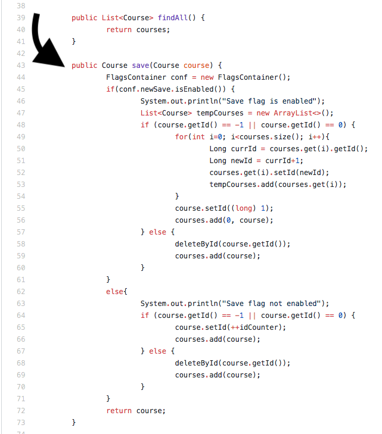
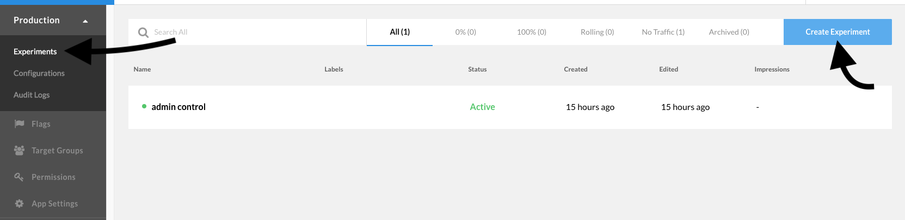
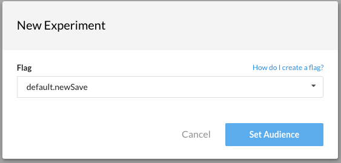
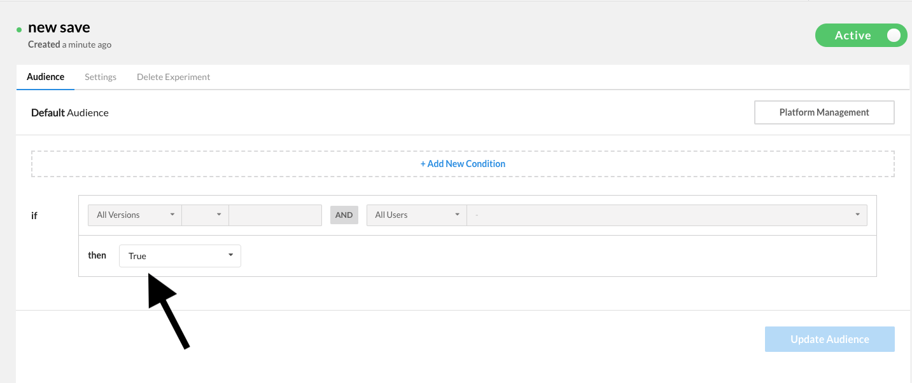
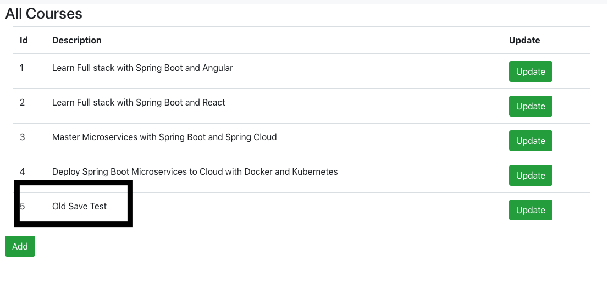
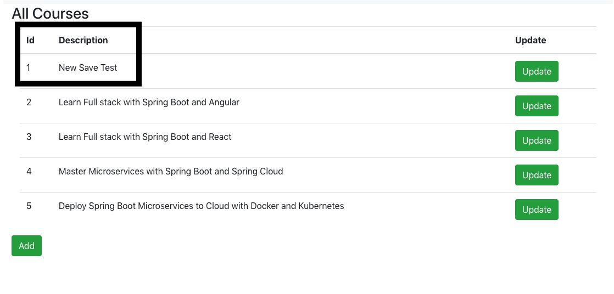
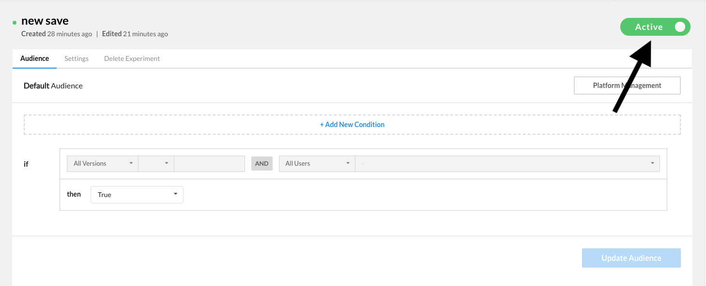
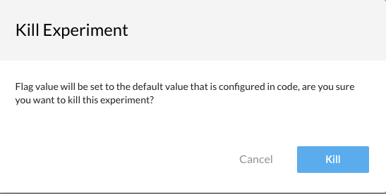
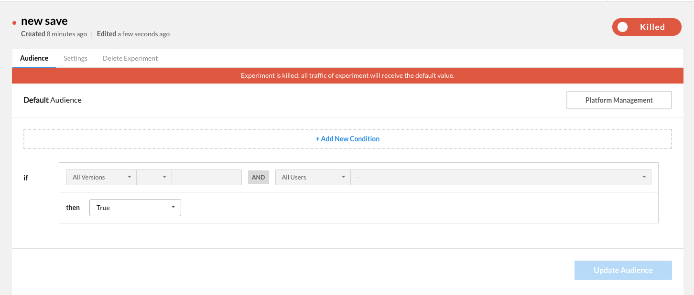

# Implementing feature flags in the back end
So far we have implemented the Rollout React SDK in our front end code, created a feature flag that gated specific admin privileges, and controlled the behavior of that feature flag through the Rollout dashboard. In this lab we will get an introduction to the Rollout Java SDK and learn how to gate newly developed back-end features behind feature flags. Then we will control our newly created feature flags from same Rollout dashboard again.

## Feature Flag Implementation
In this lab we will be implementing a new save functionality. However we might not be sure of how this new functionality will behave in our production environment so we want to gate this new feature behind a feature flag. 

First, head to (the container class for our Java code) /backend-spring-boot-react-crud-full-stack-with-maven/src/main/java/com/in28minutes/fullstack/springboot/maven/crud/springbootcrudfullstackwithmaven/FlagsContainer.java

In there we will add a new flag called newSave. Replace the FlagsContainer declaration on line 8 with the following code snippet:
```
public class FlagsContainer implements RoxContainer {
	public RoxFlag addFlag = new RoxFlag();
	public RoxFlag newSave = new RoxFlag();
}
```
Notice that newSave flag is enabled to be false by default, so this means that once we push this change into production, our new save functionality will not be enabled by default for all users. 

Now that we have defined our New Save feature flag, we will want to go ahead and actually implement our new save course functioanlity. Head into /backend-spring-boot-react-crud-full-stack-with-maven/src/main/java/com/in28minutes/fullstack/springboot/maven/crud/springbootcrudfullstackwithmaven/course/CoursesHardcodedService.java

Here we will want to update the save() method. The current save configuration logic works like this: when a new course is saved, it is added to the bottom of the list with its ID being the lastID+1. The new save functionality that we want to implement will add the new course to the top of the course list, give it an ID of 1, and move all of the other courses down 1 spot and increase their ID by 1. 

Instead of completely replacing the old save functionality with the new, we will keep both in our code and gate the new save functionality behind a feature flag. As mentioned before, we're doing this because we want to be safe with our deployment of this new feature. If for some reason our new save feature breaks in production, we want to have it wrapped in a feature flag so that we could kill the new feature, and still have the old feature as a back up.

In CoursesHardcodedService.java replace the current ```public Course save(Course course)``` method on line 43 with the code below:
```
public Course save(Course course) {
		FlagsContainer conf = new FlagsContainer();
		if(conf.newSave.isEnabled()) {
			System.out.println("Save flag is enabled");
			List<Course> tempCourses = new ArrayList<>();
			if (course.getId() == -1 || course.getId() == 0) {
				for(int i=0; i<courses.size(); i++){
					Long currId = courses.get(i).getId();
					Long newId = currId+1;
					courses.get(i).setId(newId);
					tempCourses.add(courses.get(i));
				}
				course.setId((long) 1);
				courses.add(0, course);
			} else {
				deleteById(course.getId());
				courses.add(course);
			}
		}
		else{
			System.out.println("Save flag not enabled");
			if (course.getId() == -1 || course.getId() == 0) {
				course.setId(++idCounter);
				courses.add(course);
			} else {
				deleteById(course.getId());
				courses.add(course);
			}
		}
		return course;
	}
 ```
 
 
 <details><summary>Finished CoursesHardcodedService.java Code</summary>
  
  ```
  package com.in28minutes.fullstack.springboot.maven.crud.springbootcrudfullstackwithmaven.course;
import com.in28minutes.fullstack.springboot.maven.crud.springbootcrudfullstackwithmaven.FlagsContainer;

import java.util.ArrayList;
import java.util.List;
import java.util.concurrent.ExecutionException;

import org.springframework.stereotype.Service;

import io.rollout.configuration.RoxContainer;
import io.rollout.rox.server.Rox;

@Service
public class CoursesHardcodedService {

	private static List<Course> courses = new ArrayList<>();
	private static long idCounter = 0;
	private static FlagsContainer conf = new FlagsContainer();

	static {
		courses.add(new Course(++idCounter, "in28minutes", "Learn Full stack with Spring Boot and Angular"));
		courses.add(new Course(++idCounter, "in28minutes", "Learn Full stack with Spring Boot and React"));
		courses.add(new Course(++idCounter, "in28minutes", "Master Microservices with Spring Boot and Spring Cloud"));
		courses.add(new Course(++idCounter, "in28minutes",
				"Deploy Spring Boot Microservices to Cloud with Docker and Kubernetes"));

		try {
			Rox.register("default", conf);
			Rox.setup("").get();
		} catch (InterruptedException e) {
			// TODO Auto-generated catch block
			e.printStackTrace();
		} catch (ExecutionException e) {
			// TODO Auto-generated catch block
			e.printStackTrace();
		}
	}

	public List<Course> findAll() {
		return courses;
	}

	public Course save(Course course) {
		if(conf.newSave.isEnabled()) {
			System.out.println("Save flag is enabled");
			List<Course> tempCourses = new ArrayList<>();
			if (course.getId() == -1 || course.getId() == 0) {
				for(int i=0; i<courses.size(); i++){
					Long currId = courses.get(i).getId();
					Long newId = currId+1;
					courses.get(i).setId(newId);
					tempCourses.add(courses.get(i));
				}
				course.setId((long) 1);
				courses.add(0, course);
			} else {
				deleteById(course.getId());
				courses.add(course);
			}
		}
		else{
			System.out.println("Save flag not enabled");
			if (course.getId() == -1 || course.getId() == 0) {
				course.setId(++idCounter);
				courses.add(course);
			} else {
				deleteById(course.getId());
				courses.add(course);
			}
		}
		return course;
	}

	public Course deleteById(long id) {
		// Course course = findById(id);

		// if (course == null)
		// 	return null;

		// if (courses.remove(course)) {
		// 	return course;
		// }

		return null;
	}

	public Course findById(long id) {
		for (Course course : courses) {
			if (course.getId() == id) {
				return course;
			}
		}

		return null;
	}
}
```
</details>


## Redeploying the Back-End
First go into the back-end directory (Rollout-Workshop-Final/backend-spring-boot-react-crud-full-stack-with-maven)

Run the following Docker command to stop the currently running front-end container: ```docker rm $(docker stop $(docker ps -a -q --filter ancestor=rollout-java --format="{{.ID}}"))```

Now let's rebuild our Docker image with all of our code changes from before: ```docker build -t rollout-java .```

And once the image has built, we will run that image inside of a Docker container with the following command: ```docker run -d -p 8080:8080 rollout-java```

Once the deployment completes, head over into the web-app (localhost:3000), where we will test out the new save functionality. As mentioned earlier, when we defined the newSave flag, we defined it to be false by default. This means that when we head into the application, our new save functionality will not be active. To make it active we will have to head into the dashboard and create an experiment for our new save functionality.

## Using the Rollout Dashboard

Now we will go into the dashboard and create an experiment around our newSave feature flag. 

Expand the production tab on the left and click on "Experiments". Then click the "Create Experiments" button on the top right. 



From the dropdown, select "default.newSave", as that is the feature flag that we have added to our Java code to control our new save feature. After selecting "default.newSave" hit the "Set Audience" button. 



Set the default behavior to True, and hit update audience to enable our new save functionality.



Go ahead and head back into the web app, refresh the page, and you can now try adding a new course, and you will see that the new save functionality is now in action. 

Go ahead and add a new course, naming it whatever you want, and then hit save. As you can hopefully see, now our course is saved at the top of the list instead of the bottom.

Old save functionality:


New save functionality:

## Using the Kill Switch

The next thing we will show is how to utilize the "Kill Switch" feature offered with the Rollout dashboard. 

We have deployed our new save functionality to all of our users in our production environment. But what if something went wrong with this new feature? Let's assume that all of a sudden the feature stops working in our production environment. Instead of going back into the code and pushing our old save functionalit all the way through, we can just kill our new feature.

In the Rollout dashboard, in the "new save" experiment that we have just created, click on the big green "Active" button in the top right corner.



You will then see the "Kill Experiment" pop up, where you will hit the "Kill" button. 



After that your experiment has been killed, and now the default flag value is in use for all users in your production environment.



Go ahead and head back into the web app and you can now try adding a new course, and you will see that the old save functionality is now in action. 

Congratulations! You have implemented feature flags in your Java back-end and toggled them in your production environment using the Rollout dashboard, and you have successfuly utilized the Kill Switch.

You may proceed to the next lab [*Lab 3. Controlling a Single Front End and Back End Feature with Rollout*](./full-stack-feature-flags.md) or head back to the main list of the [**labs**](./README.md#workshop-labs) when you are ready.
