# Implementing feature flags in the front end

In this lab we will get an introduction to the Rollout dashboard and the Rollout React SDK and learn how to gate newly developed features behind feature flags. Then we will control our newly created feature flags from the Rollout dashboard.

First off make sure you have forked and cloned locally the following repository: https://github.com/cloudbees-days/Rollout-Workshop-Final

## Dashboard Set Up
First log in to the Rollout dashboard with the account that you created in the Setup steps. Navigate to "App Settings" on the left and then "Environments" at the top. From there, copy the Production environment key as shown below. 
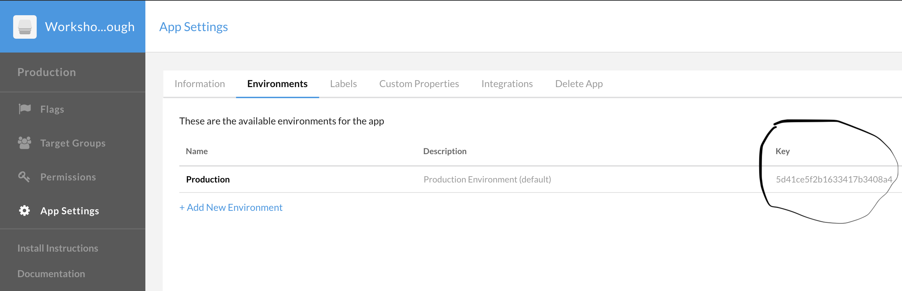

Now copy this key into:

```/frontend-spring-boot-react-crud-full-stack-with-maven/src/flags.js```

Make sure to save the file after you update it. 
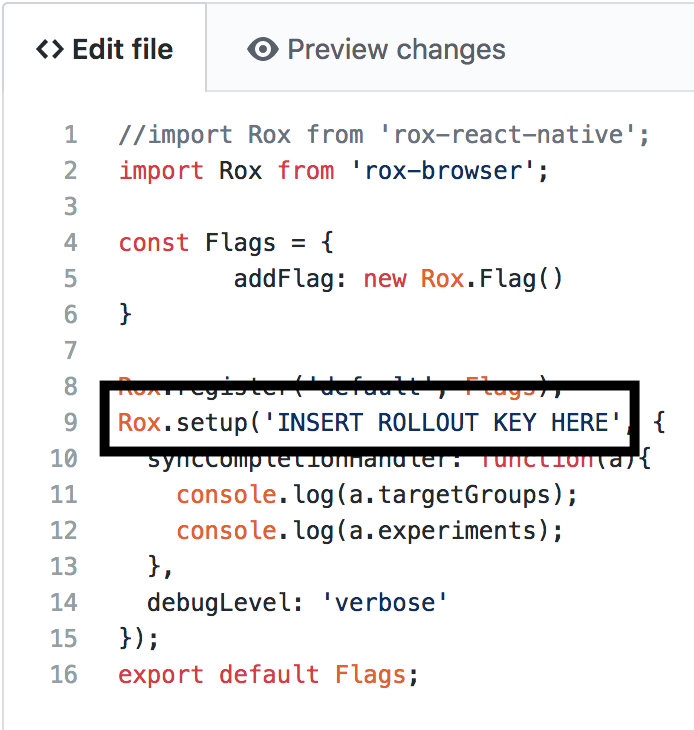

And into ```/backend-spring-boot-react-crud-full-stack-with-maven/src/main/java/com/in28minutes/fullstack/springboot/maven/crud/springbootcrudfullstackwithmaven/course/CoursesHardcodedService.java```

Make sure to save the file after you update it. 
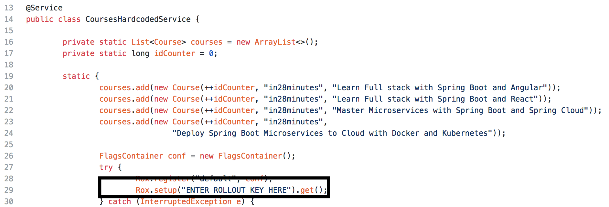

## Initial WebApp Setup
Now that we have updated our Rollout API keys, let's go ahead and deploy the application using Docker, to get an initial view of our web app. 
Your Dockerfiles have been premade for you, so all we have to do is build our Docker images using those Dockerfiles, and then run those images as containers locally.

Open your terminal and go into the root folder of the Rollout-Workshop-Final repository.

Head into frontend folder in your terminal: ```cd frontend-spring-boot-react-crud-full-stack-with-maven/```

Then run the following Docker command: ```docker build -t rollout-js . ```

This will build a Docker image based on the Dockerfile inside the frontend-spring-boot-react-crud-full-stack-with-maven folder

Once the image has built, we will run that image inside of a Docker container with the following command: ```docker run -d -p 3000:3000 rollout-js```

Now step into the backend folder: ```cd ../backend-spring-boot-react-crud-full-stack-with-maven/```

Then run the following Docker command: ```docker build -t rollout-java . ```

This will build a Docker image based on the Dockerfile inside the backend-spring-boot-react-crud-full-stack-with-maven folder

Once the image has built, we will run that image inside of a Docker container with the following command: ```docker run -d -p 8080:8080 rollout-java```

Now go to http://localhost:3000 to see your webapp in action.

## Feature Flag Implementation

In this first lab we will be adding a feature flag called Admin Control, with the idea of creating an admin and a regular user role for our web application. An admin will have all of the access that you see initially, the ability to add new courses and edit existing ones. Regular users will only be able to view existing courses, they will not be able to add new courses or edit existing ones. 

First, head to ```/frontend-spring-boot-react-crud-full-stack-with-maven/src/flags.js```
In there we will add a flag called adminFlag inside the Flags constant.
Replace the const Flags declaration on line 4 with the code snippet below and then save your file:
```
const Flags = {
	addFlag: new Rox.Flag(),
	adminControl: new Rox.Flag()
}
```
Your entire ```/frontend-spring-boot-react-crud-full-stack-with-maven/src/flags.js``` file should now look like 
<details><summary>this:</summary>
	
```
import Rox from 'rox-browser';

const Flags = {
	addFlag: new Rox.Flag(),
	adminControl: new Rox.Flag()
}

Rox.register('default', Flags);
Rox.setup('INSERT ROLLOUT KEY HERE', {
  syncCompletionHandler: function(a){
    console.log(a.targetGroups);
    console.log(a.experiments);
  },
  debugLevel: 'verbose'
});
export default Flags;
```
</details>

Now we will wrap the existing front-end admin functionality in this new flag and then create regular user functionality as well.
Head to ```/frontend-spring-boot-react-crud-full-stack-with-maven/src/component/ListCoursesComponent.jsx```
First we need to import our Container Class in which we have defined our feature flags (the flags.js file)
Add the following line on line 3:
```
import Flags from '../flags.js';
```
Then we will define the constant that will check if the adminControl flag is enabled. Add the following line of code inside the render() on line 57.
```
const adminFlag = Flags.adminControl.isEnabled();
```
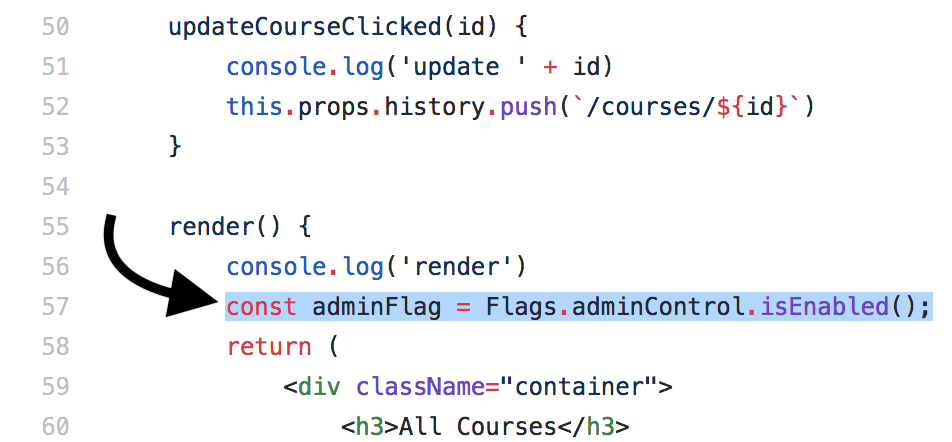

And now we will wrap the "Update" and "Add" buttons in a conditional that checks the value of our adminControl flag, and we will also create a new "View" button for the regular user.

Replace your return function with the code below:
```
return (
            <div className="container">
                <h3>All Courses</h3>
                {this.state.message && <div class="alert alert-success">{this.state.message}</div>}
                <div className="container">
                    <table className="table">
                        <thead>
                            <tr>
                                <th>Id</th>
                                <th>Description</th>
                                { adminFlag ?
                                    <th>Update</th>
                                : 
                                    <th>View</th> 
                                }
                                {/*<th>Delete</th>*/}
                            </tr>
                        </thead>
                        <tbody>
                            {
                                this.state.courses.map(
                                    course =>
                                        <tr key={course.id}>
                                            <td>{course.id}</td>
                                            <td>{course.description}</td>
                                            { adminFlag ?
                                                <td><button className="btn btn-success" onClick={() => this.updateCourseClicked(course.id)}>Update</button></td>
                                            : 
                                                <td><button className="btn btn-success" onClick={() => this.updateCourseClicked(course.id)}>View</button></td>
                                            }
                                            {/*<td><button className="btn btn-warning" onClick={() => this.deleteCourseClicked(course.id)}>Delete</button></td>*/}
                                        </tr>
                                )
                            }
                        </tbody>
                    </table>
                    { adminFlag ?
                        <div className="row">
                            <button className="btn btn-success" onClick={this.addCourseClicked}>Add</button>
                        </div>
                    : null }
                </div>
            </div>
        )
```

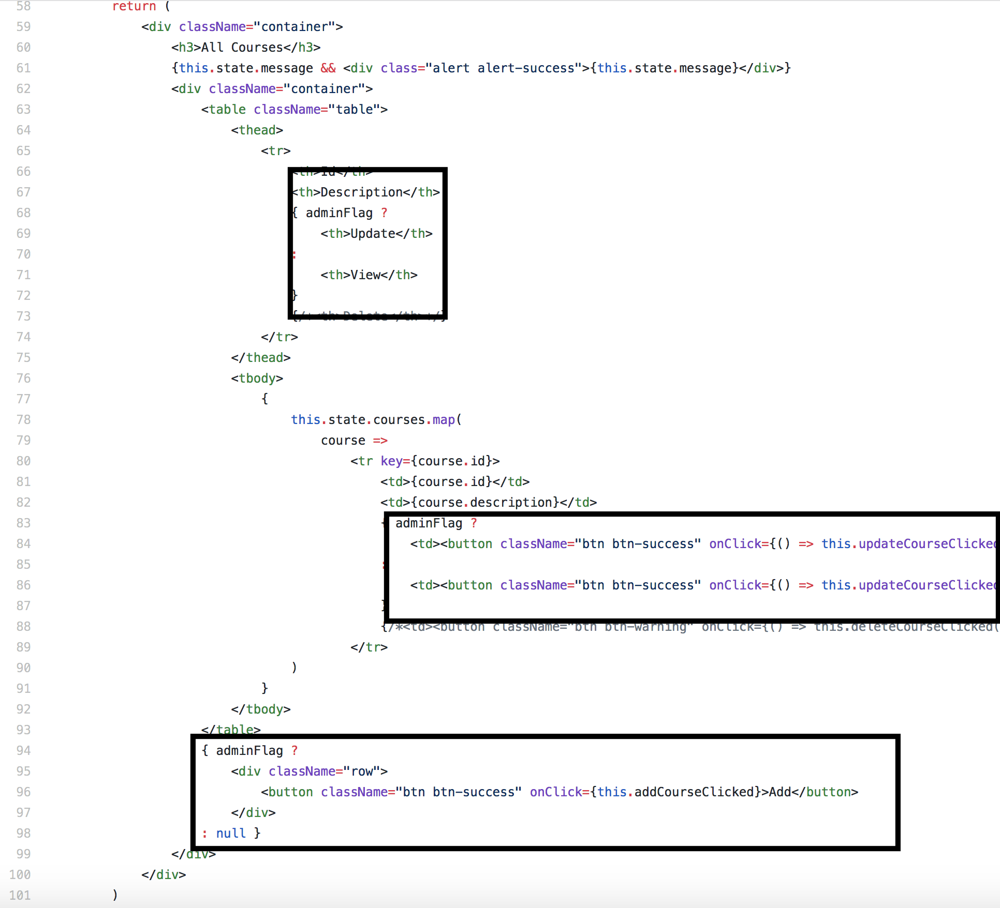

<details><summary>Finished ```ListCoursesComponent.jsx``` code:</summary>

```
import React, { Component } from 'react'
import CourseDataService from '../service/CourseDataService';
import Flags from '../flags.js';


const INSTRUCTOR = 'in28minutes'

class ListCoursesComponent extends Component {
    constructor(props) {
        super(props)
        this.state = {
            courses: [],
            message: null
        }
        //this.deleteCourseClicked = this.deleteCourseClicked.bind(this)
        this.updateCourseClicked = this.updateCourseClicked.bind(this)
        this.addCourseClicked = this.addCourseClicked.bind(this)
        this.refreshCourses = this.refreshCourses.bind(this)
    }

    componentDidMount() {
        this.refreshCourses();
    }

    refreshCourses() {
        CourseDataService.retrieveAllCourses(INSTRUCTOR)//HARDCODED
            .then(
                response => {
                    //console.log(response);
                    this.setState({ courses: response.data })
                }
            )
    }

    // deleteCourseClicked(id) {
    //     CourseDataService.deleteCourse(INSTRUCTOR, id)
    //         .then(
    //             response => {
    //                 this.setState({ message: `Delete of course ${id} Successful` })
    //                 this.refreshCourses()
    //             }
    //         )

    // }

    addCourseClicked() {
        this.props.history.push(`/courses/-1`)
    }

    updateCourseClicked(id) {
        console.log('update ' + id)
        this.props.history.push(`/courses/${id}`)
    }

    render() {
        console.log('render')
        const adminFlag = Flags.adminControl.isEnabled();
        return (
            <div className="container">
                <h3>All Courses</h3>
                {this.state.message && <div class="alert alert-success">{this.state.message}</div>}
                <div className="container">
                    <table className="table">
                        <thead>
                            <tr>
                                <th>Id</th>
                                <th>Description</th>
                                { adminFlag ?
                                    <th>Update</th>
                                : 
                                    <th>View</th> 
                                }
                                {/*<th>Delete</th>*/}
                            </tr>
                        </thead>
                        <tbody>
                            {
                                this.state.courses.map(
                                    course =>
                                        <tr key={course.id}>
                                            <td>{course.id}</td>
                                            <td>{course.description}</td>
                                            { adminFlag ?
                                                <td><button className="btn btn-success" onClick={() => this.updateCourseClicked(course.id)}>Update</button></td>
                                            : 
                                                <td><button className="btn btn-success" onClick={() => this.updateCourseClicked(course.id)}>View</button></td>
                                            }
                                            {/*<td><button className="btn btn-warning" onClick={() => this.deleteCourseClicked(course.id)}>Delete</button></td>*/}
                                        </tr>
                                )
                            }
                        </tbody>
                    </table>
                    { adminFlag ?
                        <div className="row">
                            <button className="btn btn-success" onClick={this.addCourseClicked}>Add</button>
                        </div>
                    : null }
                </div>
            </div>
        )
    }
}
export default ListCoursesComponent
```
</details>

Now head into ```/frontend-spring-boot-react-crud-full-stack-with-maven/src/component/CourseComponent.jsx```

First we need to import our Container Class in which we have defined our feature flags (the flags.js file)
Add the following line on line 4:
```
import Flags from '../flags.js';
```
We will define the constant that will check if the adminControl flag is enabled. Add the following line of code inside the render() on line 71, right before the return function.
```
const adminFlag = Flags.adminControl.isEnabled();
```
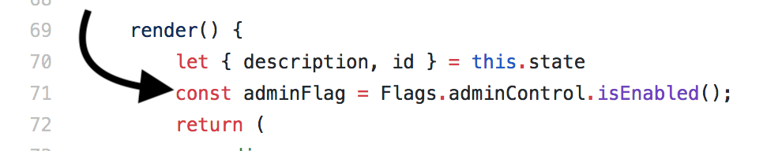

And now we will wrap the "Save" button and the Description field in a conditional that checks the value of our adminControl flag.

Replace your return function with the code below:
```
return (
            <div>
                <h3>Course</h3>
                <div className="container">
                    <Formik
                        initialValues={{ id, description }}
                        onSubmit={this.onSubmit}
                        validateOnChange={false}
                        validateOnBlur={false}
                        validate={this.validate}
                        enableReinitialize={true}
                    >
                        {
                            (props) => (
                                <Form>
                                    <ErrorMessage name="description" component="div"
                                        className="alert alert-warning" />
                                    <fieldset className="form-group">
                                        <label>Id</label>
                                        <Field className="form-control" type="text" name="id" disabled />
                                    </fieldset>
                                    <fieldset className="form-group">
                                        <label>Description</label>
                                        { adminFlag ?
                                            <Field className="form-control" type="text" name="description" />
                                        :
                                            <Field className="form-control" type="text" name="description" disabled />
                                        }
                                    </fieldset>
                                    { adminFlag ?
                                        <button className="btn btn-success" type="submit">Save</button>
                                    : null }
                                </Form>
                            )
                        }
                    </Formik>

                </div>
            </div>
        )
```

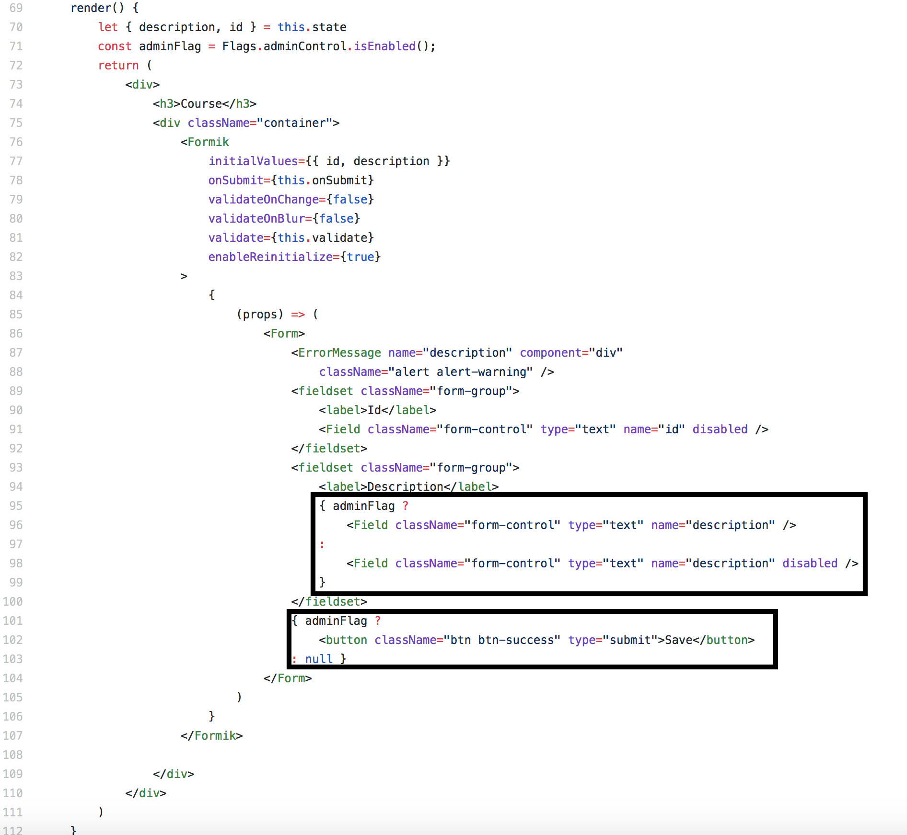

<details><summary>Finished CourseComponent.jsx code:</summary>
	
```
import React, { Component } from 'react'
import { Formik, Form, Field, ErrorMessage } from 'formik';
import CourseDataService from '../service/CourseDataService';
import Flags from '../flags.js';

const INSTRUCTOR = 'in28minutes'

class CourseComponent extends Component {
    constructor(props) {
        super(props)

        this.state = {
            id: this.props.match.params.id,
            description: ''
        }

        this.onSubmit = this.onSubmit.bind(this)
        this.validate = this.validate.bind(this)

    }

    componentDidMount() {

        console.log(this.state.id)

        // eslint-disable-next-line
        if (this.state.id == -1) {
            return
        }

        CourseDataService.retrieveCourse(INSTRUCTOR, this.state.id)
            .then(response => this.setState({
                description: response.data.description
            }))
    }

    validate(values) {
        let errors = {}
        if (!values.description) {
            errors.description = 'Enter a Description'
        } else if (values.description.length < 5) {
            errors.description = 'Enter atleast 5 Characters in Description'
        }

        return errors

    }

    onSubmit(values) {
        let username = INSTRUCTOR

        let course = {
            id: this.state.id,
            description: values.description,
            targetDate: values.targetDate
        }

        if (this.state.id === -1) {
            CourseDataService.createCourse(username, course)
                .then(() => this.props.history.push('/courses'))
        } else {
            CourseDataService.updateCourse(username, this.state.id, course)
                .then(() => this.props.history.push('/courses'))
        }

        console.log(values);
    }

    render() {
        let { description, id } = this.state
        const adminFlag = Flags.adminControl.isEnabled();
        return (
            <div>
                <h3>Course</h3>
                <div className="container">
                    <Formik
                        initialValues={{ id, description }}
                        onSubmit={this.onSubmit}
                        validateOnChange={false}
                        validateOnBlur={false}
                        validate={this.validate}
                        enableReinitialize={true}
                    >
                        {
                            (props) => (
                                <Form>
                                    <ErrorMessage name="description" component="div"
                                        className="alert alert-warning" />
                                    <fieldset className="form-group">
                                        <label>Id</label>
                                        <Field className="form-control" type="text" name="id" disabled />
                                    </fieldset>
                                    <fieldset className="form-group">
                                        <label>Description</label>
                                        { adminFlag ?
                                            <Field className="form-control" type="text" name="description" />
                                        :
                                            <Field className="form-control" type="text" name="description" disabled />
                                        }
                                    </fieldset>
                                    { adminFlag ?
                                        <button className="btn btn-success" type="submit">Save</button>
                                    : null }
                                </Form>
                            )
                        }
                    </Formik>

                </div>
            </div>
        )
    }
}

export default CourseComponent
```
</details>

## Implementing Rollout Override View
We will be adding the [Rollout Override View](https://support.rollout.io/docs/override-view) into our web-app for local testing purposes. 
The Flags Override View is used for debugging purposes. It allows developers to expose a view that shows the current status for each flag, and it allows the user to override these flags. This view is usually exposed to only developers, the QA team, and the product team.

Head into ```/frontend-spring-boot-react-crud-full-stack-with-maven/src/component/InstructorApp.jsx```
First we need to import the Rollout SDK into the InstructorApp.jsx file
Add the following import statement to line 7
```
import Rox from 'rox-browser';
```
Replace the existing Navbar code on line 13 with the following:
```
<Navbar bg="light">
	<Navbar.Brand href="../courses">Instruction Application Tutorial</Navbar.Brand>
        <Navbar.Brand>
        	<button className="btn btn-flags" onClick={() => Rox.showOverrides('bottom left')}>Flags View</button>
        </Navbar.Brand>
</Navbar>
```

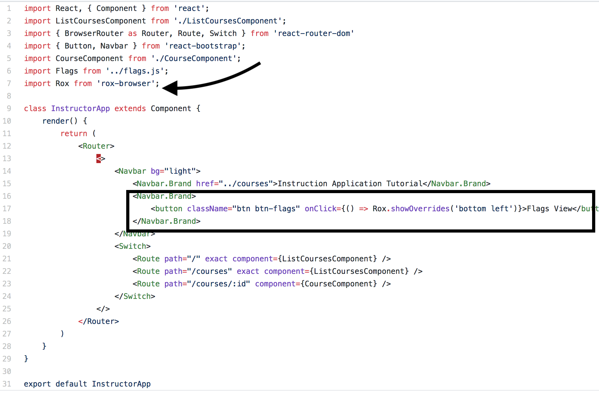

<details><summary>Finished InstructorApp.jsx code:</summary>
	
```
import React, { Component } from 'react';
import ListCoursesComponent from './ListCoursesComponent';
import { BrowserRouter as Router, Route, Switch } from 'react-router-dom'
import { Button, Navbar } from 'react-bootstrap';
import CourseComponent from './CourseComponent';
import Flags from '../flags.js';
import Rox from 'rox-browser';

class InstructorApp extends Component {
    render() {
        return (
            <Router>
                <>
                    <Navbar bg="light">
                        <Navbar.Brand href="../courses">Instruction Application Tutorial</Navbar.Brand>
                        <Navbar.Brand>
                            <button className="btn btn-flags" onClick={() => Rox.showOverrides('bottom left')}>Flags View</button>
                        </Navbar.Brand>
                    </Navbar>
                    <Switch>
                        <Route path="/" exact component={ListCoursesComponent} />
                        <Route path="/courses" exact component={ListCoursesComponent} />
                        <Route path="/courses/:id" component={CourseComponent} />
                    </Switch>
                </>
            </Router>
        )
    }
}

export default InstructorApp
```
</details>

With the Rollout Override View Implemented we can now toggle our feature flag values locally:
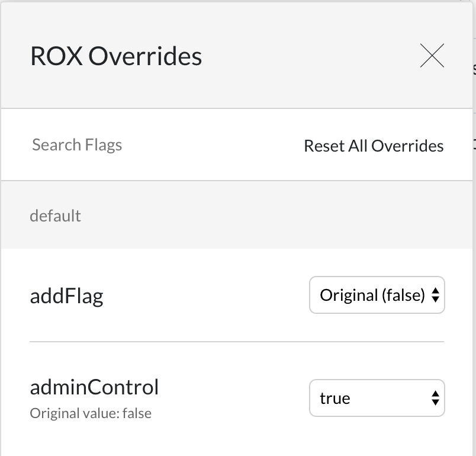

## Redeploying the Front-End
First go into the front-end directory (Rollout-Workshop-Final/frontend-spring-boot-react-crud-full-stack-with-maven)

Run the following Docker command to stop the currently running front-end container: ```docker rm $(docker stop $(docker ps -a -q --filter ancestor=rollout-js --format="{{.ID}}"))```

Now let's rebuild our Docker image with all of our code changes from before: ```docker build -t rollout-js .```

And once the image has built, we will run that image inside of a Docker container with the following command: ```docker run -d -p 3000:3000 rollout-js```

Head to http://localhost:3000 to see all of the front-end feature changes that we have implemented.

## Using the Rollout Dashboard
Now that we have created our feature flags in the code, it is time to control the flags that are active in "production" with the Rollout Dashboard. 

Head into the dashboard, expand the Production environment on the left, and click on "Experiments". You should be presented with a screen telling you to create an experiment for your feature flags. Click on the "Create Experiment" button in the middle of the screen:
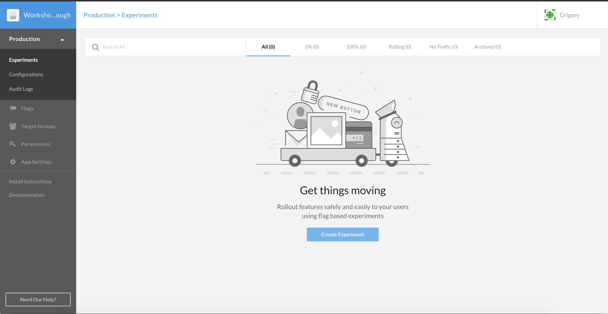

This will present you with a dropdown, where you will select default.adminControl, which is the feature flag that we have created in the code. Once you have selected adminControl from the dropdown, click "Set Audience".
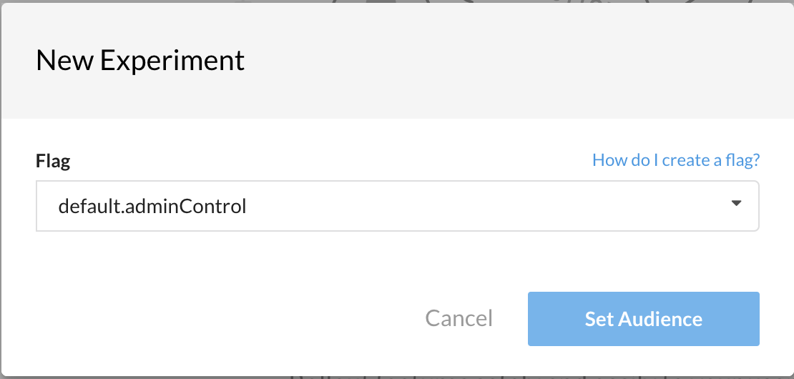

We will now be presented with the default behavior of our feature flag in the Production environment. As you can see by default the adminControl feature flag will be set to false, and we want to change that to true. Click the dropdown inside the If statement block, and select true from the dropdown. After you have selected "True", click the "Update Audience" button at the bottom.
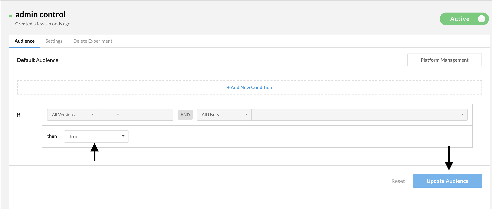

You can now head back into the webapp and you should see that the admin features are now active for all users, instead of the regular user features. 

Congratulations! You have implemented feature flags in your React webapp and toggled them in your production environment using the Rollout dashboard.

You may proceed to the next lab [*Lab 2. Implementing feature flags in the back end*](./back-end-feature-flags.md) or head back to the main list of the [**labs**](./README.md#workshop-labs) when you are ready.
