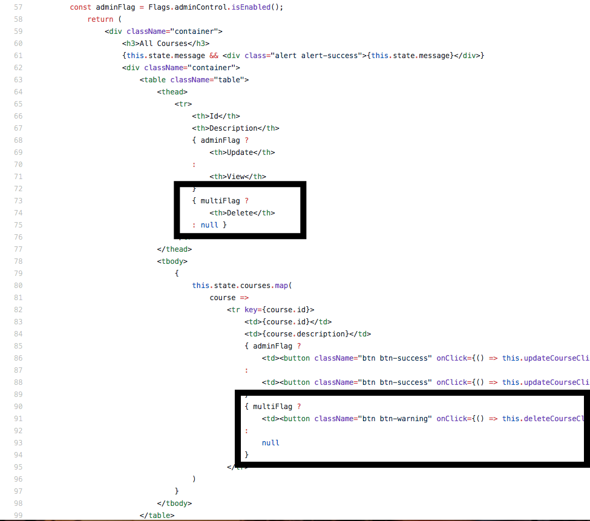

# Controlling a Single Multiplatform Feature with Rollout

So far we have implemented a new feature in the front-end and a new feature in the back-end, and we have wrapped both of those features in feature flags. However these have both been single platform features. In this lab we will be creating a feature in both the back-end and the front-end, and we will be controlling this multi-platform feature from a single experiment in the Rollout dashboard. 

The new feature that we will be introducing will be a "Delete" button in the front-end, with delete functionality in the back-end. This delete button will allow us to delete any of the existing courses currently in the web application.

## Front End Feature Implementation
We will split our feature implementation into two sections in this lab; front end implemenation and back end implementation. We will start first with the front-end implementation, the creation of the delete button. 

Head into /frontend-spring-boot-react-crud-full-stack-with-maven/src/flags.js
In there we will add a flag called multiFlag inside the Flags constant. Replace the const Flags declaration on line 4 with the code snippet below and then save your file.
```
const Flags = {
	addFlag: new Rox.Flag(),
	adminControl: new Rox.Flag(),
	multiFlag: new Rox.Flag()
}
```
Your entire /frontend-spring-boot-react-crud-full-stack-with-maven/src/flags.js file should now look like 
<details><summary>this:</summary>
	
```
import Rox from 'rox-browser';

const Flags = {
	addFlag: new Rox.Flag(),
	adminControl: new Rox.Flag(),
  multiFlag: new Rox.Flag()
}

Rox.register('default', Flags);
Rox.setup('INSERT ROLLOUT KEY HERE', {
  syncCompletionHandler: function(a){
    console.log(a.targetGroups);
    console.log(a.experiments);
  },
  debugLevel: 'verbose'
});
export default Flags;
```
</details>

Now we will actually go ahead and create the Delete button in our React code.
Head to /frontend-spring-boot-react-crud-full-stack-with-maven/src/component/ListCoursesComponent.jsx
First we will define the constant that will check if our new mutliFlag is enabled. Add the following line of code inside the render() on line 56.
```
const adminFlag = Flags.multiFlag.isEnabled();
```


Next we will uncomment the Delete button code and wrap it in our new multiFlag.
First: Replace the commented out deleteCourseClicked() method on line 35 with the following code:
```
   deleteCourseClicked(id) {
        CourseDataService.deleteCourse(INSTRUCTOR, id)
            .then(
                response => {
                    this.setState({ message: `Delete of course ${id} Successful` })
                    this.refreshCourses()
                }
            )

    }
```


Next: Replace the return function code with the code below:
```
return (
                <div className="container">
                    <h3>All Courses</h3>
                    {this.state.message && <div class="alert alert-success">{this.state.message}</div>}
                    <div className="container">
                        <table className="table">
                            <thead>
                                <tr>
                                    <th>Id</th>
                                    <th>Description</th>
                                    { adminFlag ?
                                        <th>Update</th>
                                    : 
                                        <th>View</th> 
                                    }
                                    { multiFlag ?
                                        <th>Delete</th>
                                    : null }
                                </tr>
                            </thead>
                            <tbody>
                                {
                                    this.state.courses.map(
                                        course =>
                                            <tr key={course.id}>
                                                <td>{course.id}</td>
                                                <td>{course.description}</td>
                                                { adminFlag ?
                                                    <td><button className="btn btn-success" onClick={() => this.updateCourseClicked(course.id)}>Update</button></td>
                                                : 
                                                    <td><button className="btn btn-success" onClick={() => this.updateCourseClicked(course.id)}>View</button></td>
                                                }
                                                { multiFlag ?
                                                    <td><button className="btn btn-warning" onClick={() => this.deleteCourseClicked(course.id)}>Delete</button></td>
                                                : 
                                                    null 
                                                }
                                            </tr>
                                    )
                                }
                            </tbody>
                        </table>
                        { adminFlag ?
                        <div className="row">
                            <button className="btn btn-success" onClick={this.addCourseClicked}>Add</button>
                        </div>
                        : null }
                    </div>
                </div>
            )
```


<details><summary>Finished ListCoursesComponent.jsx code:</summary>

```
import React, { Component } from 'react'
import CourseDataService from '../service/CourseDataService';
import Flags from '../flags.js';

const INSTRUCTOR = 'in28minutes'

class ListCoursesComponent extends Component {
    constructor(props) {
        super(props)
        this.state = {
            courses: [],
            message: null
        }
        this.deleteCourseClicked = this.deleteCourseClicked.bind(this)
        this.updateCourseClicked = this.updateCourseClicked.bind(this)
        this.addCourseClicked = this.addCourseClicked.bind(this)
        this.refreshCourses = this.refreshCourses.bind(this)
    }

    componentDidMount() {
        this.refreshCourses();
    }

    refreshCourses() {
        CourseDataService.retrieveAllCourses(INSTRUCTOR)//HARDCODED
            .then(
                response => {
                    //console.log(response);
                    this.setState({ courses: response.data })
                }
            )
    }

    deleteCourseClicked(id) {
        CourseDataService.deleteCourse(INSTRUCTOR, id)
            .then(
                response => {
                    this.setState({ message: `Delete of course ${id} Successful` })
                    this.refreshCourses()
                }
            )

    }

    addCourseClicked() {
        this.props.history.push(`/courses/-1`)
    }

    updateCourseClicked(id) {
        console.log('update ' + id)
        this.props.history.push(`/courses/${id}`)
    }

    render() {
        console.log('render')
        const multiFlag = Flags.multiFlag.isEnabled();
        const adminFlag = Flags.adminControl.isEnabled();
            return (
                <div className="container">
                    <h3>All Courses</h3>
                    {this.state.message && <div class="alert alert-success">{this.state.message}</div>}
                    <div className="container">
                        <table className="table">
                            <thead>
                                <tr>
                                    <th>Id</th>
                                    <th>Description</th>
                                    { adminFlag ?
                                        <th>Update</th>
                                    : 
                                        <th>View</th> 
                                    }
                                    { multiFlag ?
                                        <th>Delete</th>
                                    : null }
                                </tr>
                            </thead>
                            <tbody>
                                {
                                    this.state.courses.map(
                                        course =>
                                            <tr key={course.id}>
                                                <td>{course.id}</td>
                                                <td>{course.description}</td>
                                                { adminFlag ?
                                                    <td><button className="btn btn-success" onClick={() => this.updateCourseClicked(course.id)}>Update</button></td>
                                                : 
                                                    <td><button className="btn btn-success" onClick={() => this.updateCourseClicked(course.id)}>View</button></td>
                                                }
                                                { multiFlag ?
                                                    <td><button className="btn btn-warning" onClick={() => this.deleteCourseClicked(course.id)}>Delete</button></td>
                                                : 
                                                    null 
                                                }
                                            </tr>
                                    )
                                }
                            </tbody>
                        </table>
                        { adminFlag ?
                        <div className="row">
                            <button className="btn btn-success" onClick={this.addCourseClicked}>Add</button>
                        </div>
                        : null }
                    </div>
                </div>
            )


    }
}

export default ListCoursesComponent
```
</details>


## Redeploying the Front-End
First go into the front-end directory (Rollout-Workshop-Final/frontend-spring-boot-react-crud-full-stack-with-maven)

Run the following Docker command to stop the currently running front-end container: ```docker rm $(docker stop $(docker ps -a -q --filter ancestor=rollout-js --format="{{.ID}}"))```

Now let's rebuild our Docker image with all of our code changes from before: ```docker build -t rollout-js .```

And once the image has built, we will run that image inside of a Docker container with the following command: ```docker run -d -p 3000:3000 rollout-js```

This will deploy our front-end implementation, but we still need to create the delete functionality in the back-end as well.

## Back End Feature Implementation 

Now that we have implemented our front-end feature, the delete button, we need to also implement the back-end Java logic that will actually handle the delete logic. 

Head over into backend-spring-boot-react-crud-full-stack-with-maven/src/main/java/com/in28minutes/fullstack/springboot/maven/crud/springbootcrudfullstackwithmaven/FlagsContainer.java

In there we will add a new flag called multiFlag. Replace the FlagsContainer declaration on line 8 with the following code snippet:
```
public class FlagsContainer implements RoxContainer {
	public RoxFlag addFlag = new RoxFlag();
	public RoxFlag newSave = new RoxFlag();
	public RoxFlag multiFlag = new RoxFlag();
}	
```
Notice that the flag we added in the back-end is named the same thing as the flag added in the front-end. This is how you control multiplatform features under a single feature flag experiment in the Rollout dashboard. 

Just as before, now that we have defined our New Save feature flag, we will want to go ahead and actually implement our new delete course functioanlity. Head into /backend-spring-boot-react-crud-full-stack-with-maven/src/main/java/com/in28minutes/fullstack/springboot/maven/crud/springbootcrudfullstackwithmaven/course/CoursesHardcodedService.java

Once in there, replace the ```public Course deleteByID(long id)``` method on line 76 with the following code snippet:
```
	public Course deleteById(long id) {
		FlagsContainer conf = new FlagsContainer();
		if(conf.multiFlag.isEnabled()) {
			Course course = findById(id);

			if (course == null)
				return null;

			if (courses.remove(course)) {
				return course;
			}
		}

		return null;
	}
```


<details><summary>Finished CoursesHardCodedService.java</summary>
	
```
package com.in28minutes.fullstack.springboot.maven.crud.springbootcrudfullstackwithmaven.course;

import java.util.ArrayList;
import java.util.List;
import java.util.concurrent.ExecutionException;

import org.springframework.stereotype.Service;
import com.in28minutes.fullstack.springboot.maven.crud.springbootcrudfullstackwithmaven.FlagsContainer;

import io.rollout.configuration.RoxContainer;
import io.rollout.rox.server.Rox;

@Service
public class CoursesHardcodedService {

	private static List<Course> courses = new ArrayList<>();
	private static long idCounter = 0;
	private static FlagsContainer conf = new FlagsContainer();

	static {
		courses.add(new Course(++idCounter, "in28minutes", "Learn Full stack with Spring Boot and Angular"));
		courses.add(new Course(++idCounter, "in28minutes", "Learn Full stack with Spring Boot and React"));
		courses.add(new Course(++idCounter, "in28minutes", "Master Microservices with Spring Boot and Spring Cloud"));
		courses.add(new Course(++idCounter, "in28minutes",
				"Deploy Spring Boot Microservices to Cloud with Docker and Kubernetes"));
		try {
			Rox.register("default", conf);
			Rox.setup("5d41ce5f2b1633417b3408a4").get();
		} catch (InterruptedException e) {
			// TODO Auto-generated catch block
			e.printStackTrace();
		} catch (ExecutionException e) {
			// TODO Auto-generated catch block
			e.printStackTrace();
		}
	}

	public List<Course> findAll() {
		return courses;
	}

	public Course save(Course course) {
		if(conf.newSave.isEnabled()) {
			System.out.println("Save flag is enabled");
			List<Course> tempCourses = new ArrayList<>();
			if (course.getId() == -1 || course.getId() == 0) {
				for(int i=0; i<courses.size(); i++){
					Long currId = courses.get(i).getId();
					Long newId = currId+1;
					courses.get(i).setId(newId);
					tempCourses.add(courses.get(i));
				}
				course.setId((long) 1);
				courses.add(0, course);
			} else {
				deleteById(course.getId());
				courses.add(course);
			}
		}
		else{
			System.out.println("Save flag not enabled");
			if (course.getId() == -1 || course.getId() == 0) {
				course.setId(++idCounter);
				courses.add(course);
			} else {
				deleteById(course.getId());
				courses.add(course);
			}
		}
		return course;
	}

	public Course deleteById(long id) {
		FlagsContainer conf = new FlagsContainer();
		if(conf.multiFlag.isEnabled()) {
			Course course = findById(id);

			if (course == null)
				return null;

			if (courses.remove(course)) {
				return course;
			}
		}

		return null;
	}

	public Course findById(long id) {
		for (Course course : courses) {
			if (course.getId() == id) {
				return course;
			}
		}

		return null;
	}
}
```
</details>

As you can see, we first define our FlagsContainer object, and then we wrap our delete functionality in our multiFlag flag. If the multiFlag flag is enabled the delete functionality works correctly, and if the multiFlag flag is not enabled, then there is no delete functionality.

## Redeploying the Back-End
First go into the back-end directory (Rollout-Workshop-Final/backend-spring-boot-react-crud-full-stack-with-maven)

Run the following Docker command to stop the currently running front-end container: ```docker rm $(docker stop $(docker ps -a -q --filter ancestor=rollout-java --format="{{.ID}}"))```

Now let's rebuild our Docker image with all of our code changes from before: ```docker build -t rollout-java .```

And once the image has built, we will run that image inside of a Docker container with the following command: ```docker run -d -p 8080:8080 rollout-java```

Once the deployment completes, head over into the web-app (localhost:3000). However there will still be no delete button or delete functionality since the default value of the multiFlag flag is false. For that we will have to head into the dashboard and enable our new feature.

## Controlling the Multiplatform Feature in the Rollout Dashboard

Now we will go into the dashboard and create an experiment around our multi-platform multiFlag feature flag. 

Expand the production tab on the left and click on "Experiments". Then click the "Create Experiments" button on the top right.


From the dropdown, select "default.multiFlag". You might notice that even though we created two feature flags -- one in the back-end and one in the front-end -- there is only one option available here. That is due to the fact that we named the flags the same thing in both sides of the application. This will allow us to control both feature flags under a single experiment in the Rollout dashboard. After selecting "default.multiFlag" hit the "Set Audience" button. 


Inside the experiment details, hit the "Platform Management" button in the top right. 


In there you can toggle which platform you want this experiment to control, with all platforms being enabled by default. We will not be changing anything in this viiew, this was just to show that the multiFlag experiment in the dashboard will control both platforms. Go ahead and click cancel. 


Finally we will set the default behavior of the flag to "true" and then we will click on "Update Audience" on the bottom right.


Go ahead and head into the web app, refresh the page, and you can now see a "Delete" button available to you. If you click on any of the "Delete" buttons, you will end up deleting one of the listed courses.

Congratulations! You have implemented a feature flag in your Java back-end and in your front-end webapp, controlled both of the flags under a singular experiment in the Rollout dashboard, and toggled the flags on in your production environment.

You've reached the end of the workshop! You can head back to the main list of [**labs**](./README.md#workshop-labs) if you like.

You can learn more about Rollout at the [Rollout website](https://rollout.io/), and you can also sign up for a two week free trial of Rollout [here](https://app.rollout.io/signup).
